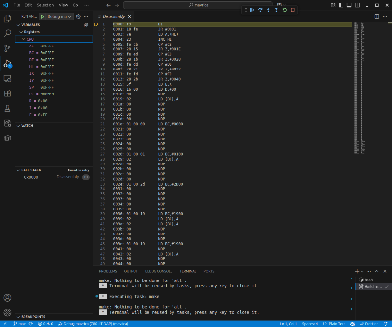

![status.badge] [![language.badge]][language.url] [![standard.badge]][standard.url] [![license.badge]][license.url]

# idp-dbg

`idp-dbg` is a cross-debugging toolchain for Z80 programs, designed for integration with Visual Studio Code on Linux. It implements the Microsoft Debug Adapter Protocol (DAP) and serves as both a lightweight emulator backend and a debug adapter frontend.

This project is used by the [mavrica](https://github.com/iskra-delta/mavrica) project (located in the same GitHub root), which uses a Z80 just-in-time (JIT) compilation core to emulate a Z80 system. `idp-dbg` enables debugging of such emulators directly from VSCode.



## Features

- Z80 binary disassembly (no source required)
- Debug Adapter Protocol implementation (fully VSCode compatible)
- Simple and clean C++23 implementation
- Instruction and memory-level debugging
- Register inspection (with subsystem trees like CPU, CTC, etc.)

## Design goals

- Portable, standard-compliant C++ with minimal dependencies
- Clear separation between emulator core and DAP frontend
- Easy to embed, reuse, or modify
- Source-level and binary-level debugging support

## Build instructions

```sh
git clone https://github.com/iskra-delta/idp-dbg.git --recurse-submodules
cd idp-dbg
cmake -B build -DCMAKE_BUILD_TYPE=Debug -DBUILD_TESTS=ON
cmake --build build
```

To run the tests:

```sh
cd build
ctest --output-on-failure
```

The build produces two key outputs:

- `build/idp-dbg` — the debug adapter binary
- `build/idp-dbg.vsix` — the Visual Studio Code extension you can install with:

```sh
code --install-extension build/idp-dbg.vsix
```

## VSCode integration

Add the following to your `.vscode/launch.json` in your project (e.g. in `mavrica`) to enable debugging:

```json
{
  "version": "0.2.0",
  "configurations": [
    {
      "name": "Debug mavrica (Z80 JIT DAP)",
      "type": "idp-gdb",
      "request": "launch",
      "program": "${workspaceFolder}/build/mavrica.bin",
      "preLaunchTask": "Build mavrica",
      "debugServer": 4711,
      "showDisassembly": "always"
    }
  ]
}
```

## Directory structure

- `src/` — main entry point and DAP TCP server
- `lib/dap/` — Debug Adapter Protocol message parser/serializer
- `lib/` — reusable internal components (emulation, memory, etc.)
- `include/` — public headers
- `tests/` — unit tests using GoogleTest
- `ext/` — Visual Studio Code extension source
- `docs/` — additional documentation

## Dependencies

Handled automatically using `FetchContent` in CMake:

- `nlohmann/json` — JSON parser (header-only)
- `sockpp` — TCP socket abstraction
- `structopt` — command-line option parsing
- `z80ex` — Z80 CPU emulator core
- `z80ex_dasm` — Z80 disassembler

## Status

This project is under active development. Current component status:

### Complete

- DAP message parsing
- DAP to emulator interface
- Disassembler output
- Register view with CPU tree
- Visual Studio Code minimal extension

### In development

- Instruction breakpoints
- Continue / Stop / Restart
- `next` (step over)

### Planned

- Watchpoints / symbols
- Source code integration
- C source line mapping

### Nice to have

- Platform support plugins (Iskra Delta Partner...)
- Custom Visual Studio Code views

## License

This project is licensed under the MIT License. See the [LICENSE](LICENSE) file for details.

## Copyright

Copyright © 2025 Tomaz Stih  
All rights reserved.

[language.url]: https://en.wikipedia.org/wiki/C%2B%2B23%2B
[language.badge]: https://img.shields.io/badge/language-C++-blue.svg
[standard.url]: https://en.cppreference.com/w/cpp/23
[standard.badge]: https://img.shields.io/badge/standard-C++23-blue.svg
[license.url]: https://github.com/tstih/libcpm3-z80/blob/main/LICENSE
[license.badge]: https://img.shields.io/badge/license-MIT-blue.svg
[status.badge]: https://img.shields.io/badge/status-alpha-orange.svg
